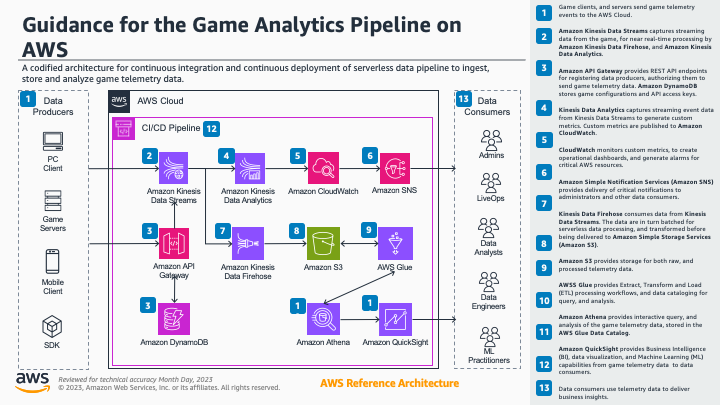

# Game Analytics Pipeline on AWS

>[!IMPORTANT] 
>This Guidance requires the use of AWS [CodeCommit](https://docs.aws.amazon.com/codecommit/latest/userguide/welcome.html), which is no longer available to new customers. Existing customers of AWS CodeCommit can continue using and deploying this Guidance as normal.


## Table of Content
- [Game Analytics Pipeline on AWS](#game-analytics-pipeline-on-aws)
  - [Table of Content](#table-of-content)
  - [Overview](#overview)
  - [Prerequisites](#prerequisites)
  - [Sample Code Configuration and Customization](#sample-code-configuration-and-customization)
    - [Configuration Setup](#configuration-setup)
    - [Custom Settings](#custom-settings)
  - [Sample Code Deployment](#sample-code-deployment)
    - [Deployed Infrastructure](#deployed-infrastructure)
    - [CI/CD Toolchain](#cicd-toolchain)
  - [Next Steps](#next-steps)
  - [Cleanup](#cleanup)
- [Security](#security)
- [License](#license)


## Overview

The games industry is increasing adoption of the Games-as-a-Service operating model, where games have become more like a service than a product, and recurring revenue is frequently generated through in-app purchases, subscriptions, and other techniques. With this change, it is critical to develop a deeper understanding of how players use the features of games and related services. This understanding allows game developers to continually adapt, and make the necessary changes to keep players engaged.

The Game Analytics Pipeline guidance helps game developers to apply a flexible, and scalable DataOps methodology to their games. Allowing them to continuously integrate, and continuously deploy (CI/CD) a scalable serverless data pipeline for ingesting, storing, and analyzing telemetry data generated from games, and services. The guidance supports streaming ingestion of data, allowing users to gain critical insights from their games, and other applications in near real-time, allowing them to focus on expanding, and improving game experience almost immediately, instead of managing the underlying infrastructure operations. Since the guidance has been codified as a CDK application, game developers can determine the best modules, or components that fit their use case, allowing them to test, and QA the best architecture before deploying into production. This modular system allows for additional AWS capabilities, such as AI/ML models, to be integrated into the architecture in order to further support real-time decision making, and automated LiveOps using AIOps, to further enhance player engagement. Essentially allowing developers to focus on expanding game functionality, rather than managing the underlying infrastructure operations.



## Prerequisites

Before deploying the sample code, ensure that the following required tools have been installed:

- **[GitHub Account](https://docs.github.com/en/get-started/start-your-journey/creating-an-account-on-github)**
- **[Visual Studio Code](https://code.visualstudio.com/Download)**
- **[Docker Desktop (local)](https://www.docker.com/products/docker-desktop/)**
- **AWS Cloud Development Kit (CDK) 2.92**
- **Python >=3.8**
- **NodeJS >= 20.0.0**

>__NOTE:__ A Visual Studio Code [dev container](https://docs.github.com/en/codespaces/setting-up-your-project-for-codespaces/adding-a-dev-container-configuration/introduction-to-dev-containers) configuration has been provided for you. This image container the necessary *Python*, *NodeJS*, and the *AWS CDK* versions needed to implement this guidance. It is **recommended**, that you use the pre-configured [environment](https://code.visualstudio.com/docs/devcontainers/containers) as your development environment.  

## Sample Code Configuration and Customization

Before deploying the sample code, it needs to be customized to suite your specific usage requirements. Guidance configuration, and customization, is managed using a `config.yaml` file, located in the `infrastructure` folder of the repository. 

### Configuration Setup

The following steps will walk you through how to customize the sample code configuration to suite your usage requirements:

1. Log into your GitHub account, and [fork this repository](https://docs.github.com/en/pull-requests/collaborating-with-pull-requests/working-with-forks/fork-a-repo) into your GitHub account.

2. Follow the instructions on how to (Create a connection to GitHub)[https://docs.aws.amazon.com/dtconsole/latest/userguide/connections-create-github.html#connections-create-github-console], to connect AWS CodePipeline to the forked copy of this repository. Once the connection has been created, make a note of the Amazon Resource Name (ARN) for the connection.

3. A configuration template file, called `config.yaml.TEMPLATE` has been provided as a reference for use case customizations. Using the provided Visual Studio Code devcontainer environment, run the following command to create a usable copy of this file:

    ```bash
    cp ./infrastructure/config.yaml.TEMPLATE ./infrastructure/config.yaml
    ```

2. Open the `./infrastructure/config.yaml` file for editing.

### Custom Settings

The following settings can be adjusted to suite your use case:

- `WORKLOAD_NAME`
  - *Description:* The name of the workload that will deployed. This name will be used as a prefix for for any component deployed into your AWS Account.
  - *Type:* String 
  - *Example:* `"GameAnalyticsPipeline"`
- `CDK_VERSION`
  - *Description:* The version of the CDK installed in your environment. To see the current version of the CDK, run the `cdk --version` command. The guidance has been tested using CDK version `2.92.0` of the CDK. If you are using a different version of the CDK, ensure that this version is also reflected in the `./infrastructure/package.json` file.
  - *Type:* String
  - *Example:* `"2.92.0"`
- `NODE_VERSION`
  - *Description:* The version of NodeJS being used. The default value is set to `"latest"`, and should only be changed this if you require a specific version.
  - *Type:* String
  - *Example:* `"latest"`
- `PYTHON_VESION`
  - *Description:* The version of Python being used. The default value is set to `"3.8"`, and should only be changed if you require a specific version.
  - *Type:* String
  - *Example:* `"3.8"`
- `DEV_MODE`
  - *Description:* Wether or not to enable developer mode. This mode will ensure synthetic data, and shorter retention times are enabled. It is recommended that you set the value to `true` when first deploying the sample code for testing, as this setting will enable S3 versioning, and won't delete S3 buckets on teardown. This setting can be changed at a later time, and the infrastructure re-deployed through CI/CD.
  - *Type:* Boolean
  - *Example:* `true`
- `ENABLE_STREAMING_ANALYTICS`
  - *Description:* Wether or not to enable the [Kinesis Data Analytics](https://aws.amazon.com/kinesis/data-analytics/) component/module of the guidance. It is recommended to set this value to `true` when first deploying this sample code for testing, as this setting will allow you to verify if streaming analytics is required for your use case. This setting can be changed at a later time, and the guidance re-deployed through CI/CD.
  - *Type:* Boolean
  - *Example:* `true`
- `STREAM_SHARD_COUNT`
  - *Description:* The number of Kinesis shards, or sequence of data records, to use for the data stream. The default value has been set to `1` for initial deployment, and testing purposes. This value can be changed at a later time, and the guidance re-deployed through CI/CD. For information about determining the shards required for your use case, refer to [Amazon Kinesis Data Streams Terminology and Concepts](https://docs.aws.amazon.com/streams/latest/dev/key-concepts.html) in the *Amazon Kinesis Data Streams Developer Guide*.
  - *Type:* Integer
  - *Example:* `1`
- `CODECOMMIT_REPO`
  - *Description:* The name of the [AWS CodeCoomit](https://aws.amazon.com/codecommit/), repository used as source control for the codified infrastructure, and CI/CD pipeline.
  - *Type:* String
  - *Example:* `"game-analytics-pipeline"`
- `RAW_EVENTS_PREFIX`
  - *Description:* The prefix for new/raw data files stored in S3.
  - *Type:* String
  - *Example:* `"raw_events"`
- `PROCESSED_EVENTS_PREFIX`
  - *Description:* The prefix processed data files stored in S3.
  - *Type:* String
  - *Example:* `"processed_events"`
- `RAW_EVENTS_TABLE`
  - *Description:* The name of the of the [AWS Glue table](https://docs.aws.amazon.com/glue/latest/dg/tables-described.html) within which all new/raw data is cataloged.
  - *Type:* String
  - *Example:* `"raw_events"`
- `GLUE_TMP_PREFIX`
  - *Description:* The name of the temporary data store for AWS Glue.
  - *Type:* String
  - *Example:* `"glueetl-tmp"`
- `S3_BACKUP_MODE`
  - *Description:* Wether or not to enable [Kinesis Data Firehose](https://aws.amazon.com/kinesis/data-firehose/) to send a backup of new/raw data to S3. The default value has been set to `false` for initial deployment, and testing purposes. This value can be changed at a later time, and the guidance re-deployed through CI/CD. 
  - *Type:* Boolean
  - *Example:* `false`
- `CLOUDWATCH_RETENTION_DAYS`
  - *Description:* The default number of days in which [Amazon CloudWatch](https://aws.amazon.com/cloudwatch/) stores all the logs. The default value has been set to `30` for initial deployment, and testing purposes. This value can be changed at a later time, and the guidance re-deployed through CI/CD. 
  - *Type:* Integer
  - *Example:* `30`
- `API_STAGE_NAME`
  - *Description:* The name of the REST API [stage](https://docs.aws.amazon.com/apigateway/latest/developerguide/set-up-stages.html) for the [Amazon API Gateway](https://aws.amazon.com/api-gateway/) configuration endpoint for sending telemetry data to the pipeline. This provides an integration option for applications that cannot integrate with Amazon Kinesis directly. The API also provides configuration endpoints for admins to use for registering their game applications with the guidance, and generating API keys for developers to use when sending events to the REST API. The default value is set to `live`.
  - *Type:* String
  - *Example:* `"live"`
- `EMAIL_ADDRESS`
  - *Description:* The email address to receive operational notifications, and delivered by CloudWatch.
  - *Type:* String
  - *Example:* `"user@example.com"`
- `GITHUB_USERNAME`
  - *Description:* The user name for the Github account, into which the guidance has been forked.
  - *Type:* String
- `GITHUB_REPO_NAME`
  - *Description:* The repository name of the fork in your GitHub account. 
  - *Type:* String
  - *Example:* `"guidance-for-game-analytics-pipeline-on-aws"`
- `CONNECTION_ARN`
  - *Description:* The ARN for the GitHub connection, created during the [Configuration Setup](#configuration-setup) section.
  - *Type* String
  - *Example:* `"arn:aws:codeconnections:us-east-1:123456789123:connection/6506b29d-429e-4bf3-8ab4-78cb2fc011b3"`
- `accounts`
  - *Description:* Leverages CDK Cross-account, Cross-region capabilities for deploying separate CI/CD pipeline stages to separate AWS Accounts, AWS Regions. For more information on Cross-account CI/CD pipelines, using the CDK, refer to the [Building a Cross-account CI/CD Pipeline](https://catalog.us-east-1.prod.workshops.aws/workshops/00bc829e-fd7c-4204-9da1-faea3cf8bd88/en-US/introduction) workshop. 
  - *Example:*
    ```yaml
    accounts:
      - NAME: "QA"
        ACCOUNT: "<YOUR-ACCOUNT-NUMBER>"
        REGION: "<QA-ACCOUNT-REGION>"
      - NAME: "PROD"
        ACCOUNT: "<YOUR-ACCOUNT-NUMBER>"
        REGION: "<PROD-ACCOUNT-REGION>"
    ```
    >__NOTE:__ It is recommended that you use the same AWS Account, as well as the same AWS Region, for both the `QA`, and `PROD` stages, when first deploying the guidance.

## Sample Code Deployment

Once you will have to add your own custom configuration settings, and saved the `config.yaml` file, then following steps can be used to deploy the CI/CD pipeline:

1. Build the sample code dependencies, by running the following command:
    ```bash
    npm run build
    ```
2. Bootstrap the sample code, by running the following command:
    ```bash
    npm run deploy.bootstrap
    ```
3. Deploy the sample code, by running the following command:
    ```bash
    npm run deploy
    ```

After the sample code has been deployed, two CloudFormation stacks are created within you AWS Account, and AWS Region:

1. `PROD-<WORKLOAD NAME>`: The deployed version of the guidance infrastructure.
2. `<WORKLOAD NAME>-Toolchain`:  The CI/CD Pipeline for the guidance.

### Deployed Infrastructure

The stack hosts the deployed production version of the AWS resources for you to validate, and further optimize the guidance for your use case. 

### CI/CD Toolchain

Once the deployed infrastructure has been validated, or further optimized for your use case, you can trigger the continuos deployment, by committing any updated source code into the newly create CodeCommit repository, using the following steps:

1. Copy the URL for cloning CodeCommit repository that you specified in the `config.yanl` file. See the **View repository details (console)** section of the [AWS CodeCommit User Guid](https://docs.aws.amazon.com/codecommit/latest/userguide/how-to-view-repository-details.html) for more information on how to vie the *Clone URL* for the repository.
2. Create a news Git repository, by running the following command:
   ```bash
   rm -rf .git
   git init --initial-branch=main
   ```
3. Add the CodeCommit repository as the origin, using the following command:
   ```bash
   git remote add origin <CodeCommit Clone URL>
   ```
4. Commit the code to trigger the CI/CD process, by running the following commands:
   ```bash
   git add -A
   git commit -m "Initial commit"
   git push --set-upstream origin
   ```

## Next Steps

Make any code changes to subsequently optimize the guidance for your use case. Committing these changes will trigger a subsequent continuous integration, and deployment of the deployed production stack, `PROD-<WORKLOAD NAME>`.

## Cleanup

To clean up any of the deployed resources, you can either delete the stack through the AWS CloudFormation console, or run the `cdk destroy` command.

>__NOTE:__ Deleting the deployed resources will not delete the Amazon S3 bucket, in order to protect any game data already ingested, and stored with the data lake. The Amazon S3 Bucket, and data, can be deleted from Amazon S3 using the Amazon S3 console, AWS SDKs, AWS Command Line Interface (AWS CLI), or REST API. See the [Deleting Amazon S3 objects](https://docs.aws.amazon.com/AmazonS3/latest/userguide/DeletingObjects.html) section of the user guide for mor information.

---
# Security

See [CONTRIBUTING](CONTRIBUTING.md#security-issue-notifications) for more information.

---
# License

This library is licensed under the MIT-0 License. See the LICENSE file.

