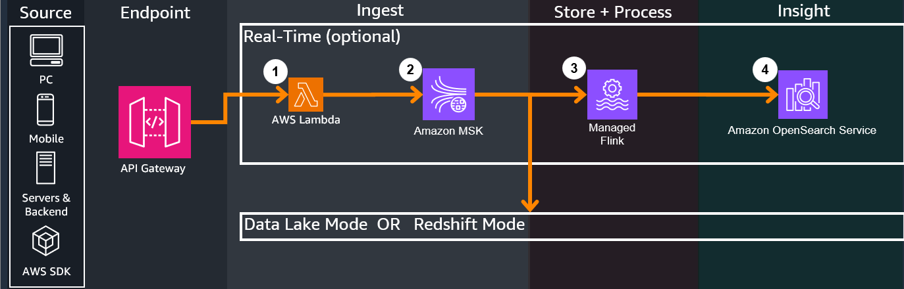

# Component Deep Dive
NOTE: Include folder hierarchy for components

---
## Overview
The Game Analytics Pipeline Guidance has the following modes:

1. `DATA_LAKE` - Deploys a lightweight data lake cost-optimized for lower data scan volume and ad-hoc queries

2. `REDSHIFT` - Deploys a serverless Redshift Data Warehouse cost-optimized for larger data scan volume and more frequent queries

From there the Guidance allows several ingest options:

1. `DIRECT_BATCH` - Does not deploy the real-time infrastructure components. Sends directly via batch in near-real-time, either to Firehose for `DATA_LAKE` mode, or to Redshift for `REDSHIFT` mode.

2. `REAL_TIME_KDS` or `REAL_TIME_MSK` - Deploys additional real-time infrastructure components for real-time analysis

For help deciding between the modes and options, or even for explanations and justifications for why we chose the services and processes below, refer to the [Design Considerations Page](./design-considerations.md)

---
## 1. Source
The Game Analytics Pipeline Guidance can accept from any HTTP/HTTPS REST based sources, such as Game Clients, Game Servers, or Backend services. Refer to the [API Reference Page](./references/api-reference.md) and [Getting Started Guide](./getting-started.md) on how to send events to the endpoint.

---

## 2. Endpoint
1. API Gateway hosts a managed REST API endpoint configured to either:

    - Send to the analytics ingest infrastructure based on the above configurations in the [overview section](./component-deep-dive.md#overview)
    - Perform [administrative tasks](./component-deep-dive.md#administration)

2. Two helper DynamoDB tables hold the following:
    - `Applications Table`: Holds Application IDs which represent a specific game/application to perform per-application analytics on. Applications can be created or deleted through [Administrative API calls](./component-deep-dive.md#administration)
    - `Authorizations Table`: Holds API authorization tokens for each Application used to authorize sending events to the Application (like a password). When sending events, the API Key's value/code is included in the `Authorization` header for security. Authorizations can be created or deleted through [Administrative API calls](./component-deep-dive.md#administration)

3. Events sent through REST API will first go through the integrated Lambda Authorizer, which dissects the API call's headers, checks the DynamoDB authorizer table entries against the one sent from the event, and [checks if the caller's IAM passed through SigV4 allows for sending events](https://docs.aws.amazon.com/apigateway/latest/developerguide/http-api-access-control-iam.html). If everything passes, API Gateway proceeds with executing the API call.

4. [Based on the guidance configurations](./component-deep-dive.md#overview), API Gateway performs the following:

    - `REAL_TIME_KDS` - [Sends a passthrough call directly to Amazon Kinesis Data Streams](https://docs.aws.amazon.com/apigateway/latest/developerguide/http-api-develop-integrations-aws-services.html) via stream in real-time
    - `REAL_TIME_MSK` - [Sends a call to a Lambda Function that interfaces as a Kafka client, sending to Amazon Managed Streaming for Apache Kafka (MSK)](https://docs.aws.amazon.com/apigateway/latest/developerguide/http-api-develop-integrations-lambda.html) via stream in real-time
    - `DIRECT_BATCH` - [Sends a passthrough call directly to the Amazon services](https://docs.aws.amazon.com/apigateway/latest/developerguide/http-api-develop-integrations-aws-services.html) via batch in near-real-time, either to Firehose for `DATA_LAKE` mode, or to Redshift for `REDSHIFT` mode.

---

## 3. Real-Time (Optional)

=== "Kinesis Data Streams"

    1. If Real-Time is enabled with Kinesis Data Streams, all incoming events from all clients will have their data ingested into Kinesis Data Streams. Kinesis Data Streams will send multiple outputs, one to the Data Lake / Redshift store for long term analytics, and the other to Managed Flink for real-time ETL

    2. Managed Flink performs SQL based queries on time windows of the incoming streaming data, sending the query outputs to OpenSearch service

    3. OpenSearch ingests the query outputs and the integrated Kibana dashboard can be accessed by users to view created widgets that display graphs and information in real-time

    

=== "Managed Streaming for Apache Kafka (MSK)"

    1. If Real-Time is enabled with MSK, a Lambda function powers the logic behind the API Gateway calls to interface as a Kafka producer client to proxy and send to the MSK service. This is because as of now there is no direct integration to the service from API Gateway.  
    
    2. MSK will send multiple outputs, one to the Data Lake / Redshift store for long term analytics, and the other to Managed Flink for real-time ETL

    3. Managed Flink performs SQL based queries on time windows of the incoming streaming data, sending the query outputs to OpenSearch service

    4. OpenSearch ingests the query outputs and the integrated Kibana dashboard can be accessed by users to view created widgets that display graphs and information in real-time

    

## 4. Data Platform

If `REAL_TIME_KDS` or `REAL_TIME_MSK` is enabled, events come from the respective streaming service.

If `DIRECT_BATCH` is enabled, events come directly from API Gateway.

=== "Data Lake Mode"

    1. Amazon Data Firehose performs the following actions on the incoming events:
        - Provides an ingest buffer on incoming data, holding events until it reaches a certain size or after certain time passes
        - Performs the following transformations on the data:
            === "test"
                - Partitioning based on date (year, month, day)
            === "test2"
                - dasd
        - dsdfsd

    

=== "Redshift Mode"

    

## Administration

## Deployment Process