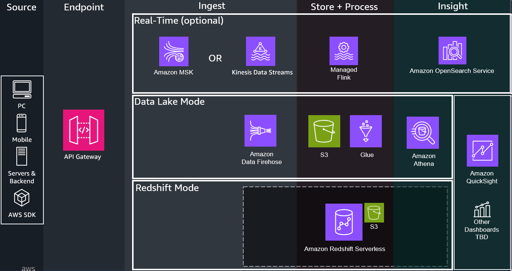
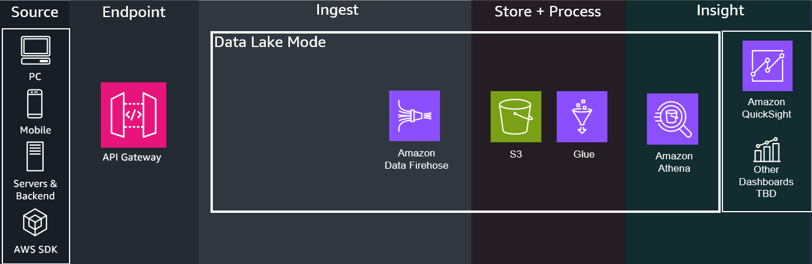
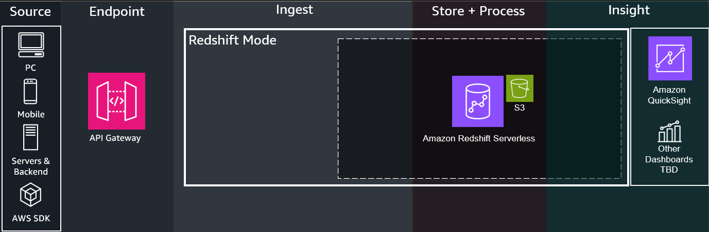
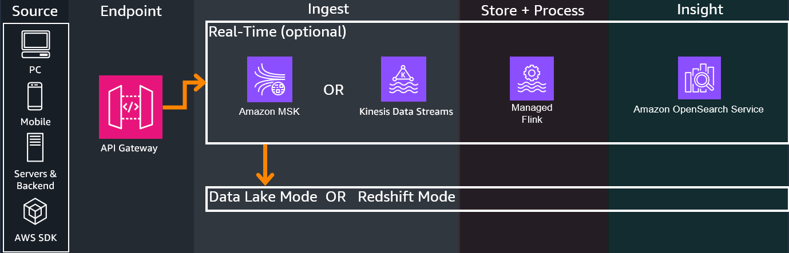
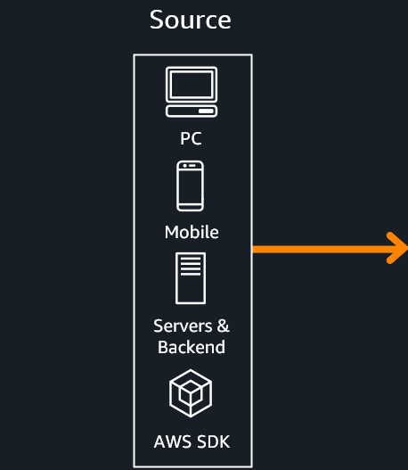
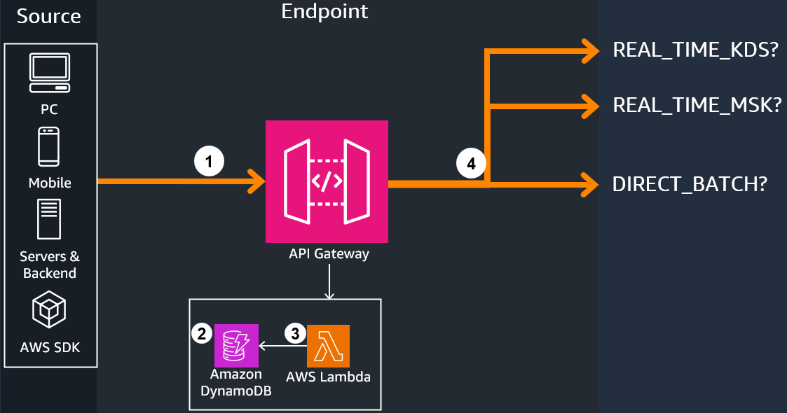
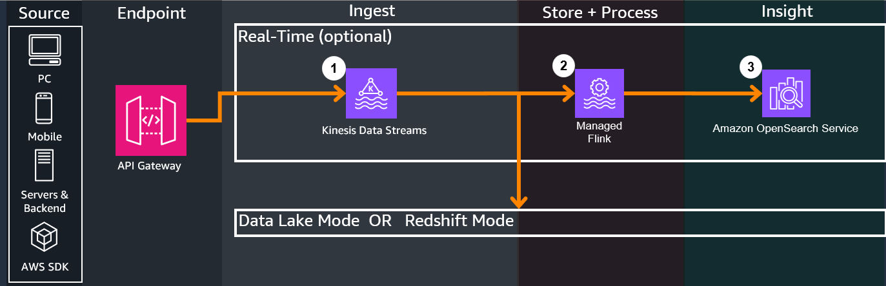
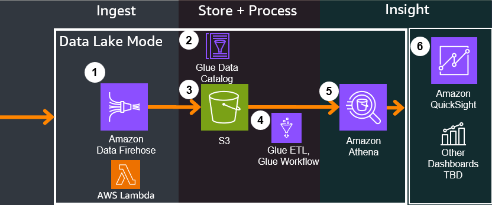
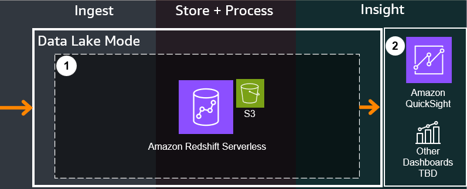

# Component Deep Dive

---
## Overview
The Game Analytics Pipeline Guidance has the following modes:

1. `DATA_LAKE` - Deploys a lightweight data lake cost-optimized for lower data scan volume and ad-hoc queries

2. `REDSHIFT` - Deploys a serverless Redshift Data Warehouse cost-optimized for larger data scan volume and more frequent queries

From there the Guidance allows several ingest options. Some ingest options are required for certain modes, refer to [Configurations Reference Page](./references/config-reference.md) for a full list:

1. `DIRECT_BATCH` - Does not deploy the real-time infrastructure components. Sends directly via batch in near-real-time to Firehose for `DATA_LAKE` mode

2. `KINESIS_DATA_STREAMS` - Deploys additional real-time infrastructure components for real-time analysis

Optionally, there is a real-time analytics mode for time-sensitive analytics:

For help deciding between the modes and options, or even for explanations and justifications for why we chose the services and processes below, refer to the [Design Considerations Page](./design-considerations.md)

---
## 1. Source
The Game Analytics Pipeline Guidance can accept from any HTTP/HTTPS REST supported sources, such as Game Clients, Game Servers, or Backend services. Refer to the [API Reference Page](./references/api-reference.md) and [Getting Started Guide](./getting-started.md) on how to send events to the endpoint.

---

## 2. Endpoint
1. API Gateway hosts a managed REST API endpoint configured to either:

    - Send to the analytics ingest infrastructure based on the above configurations in the [overview section](./component-deep-dive.md#overview)
    - Perform [administrative tasks](./component-deep-dive.md#administration)

2. Two helper DynamoDB tables hold the following:
    - `Applications Table`: Holds Application IDs which represent a specific game/application to perform per-application analytics on. Applications can be created or deleted through [Administrative API calls](./component-deep-dive.md#administration)
    - `Authorizations Table`: Holds API authorization tokens for each Application used to authorize sending events to the Application (like a password). When sending events, the API Key's value/code is included in the `Authorization` header for security. Authorizations can be created or deleted through [Administrative API calls](./component-deep-dive.md#administration)

3. Events sent through REST API will first go through the integrated Lambda Authorizer, which dissects the API call's headers, checks the DynamoDB authorizer table entries against the one sent from the event, and [checks if the caller's IAM passed through SigV4 allows for sending events](https://docs.aws.amazon.com/apigateway/latest/developerguide/http-api-access-control-iam.html). If everything passes, API Gateway proceeds with executing the API call.

4. [Based on the guidance configurations](./component-deep-dive.md#overview), API Gateway performs the following:

    - `KINESIS_DATA_STREAMS` - [Sends a passthrough call directly to Amazon Kinesis Data Streams](https://docs.aws.amazon.com/apigateway/latest/developerguide/http-api-develop-integrations-aws-services.html) via stream in real-time
    - `DIRECT_BATCH` - [Sends a passthrough call directly to the Amazon services](https://docs.aws.amazon.com/apigateway/latest/developerguide/http-api-develop-integrations-aws-services.html) via batch in near-real-time to Firehose for `DATA_LAKE` mode

---

## 3. Real-Time (Optional)

1. If Real-Time is enabled with Kinesis Data Streams, all incoming events from all clients will have their data ingested into Kinesis Data Streams. Kinesis Data Streams will send multiple outputs, one to the Data Lake / Redshift store for long term analytics, and the other to Managed Flink for real-time ETL

2. Managed Flink performs SQL based queries on time windows of the incoming streaming data, sending the query outputs to OpenSearch service

3. Kinesis Data Streams ingests from Managed Flink to OpenSearch, which ingests the query outputs and the integrated Kibana dashboard can be accessed by users to view created widgets that display graphs and information in real-time

## 4. Data Platform

If `KINESIS_DATA_STREAMS` is enabled, events come from the respective streaming service.

If `DIRECT_BATCH` is enabled, events come directly from API Gateway.

=== "Data Lake Mode"

    

    1. Amazon Data Firehose performs the following actions on the incoming events:
    
        - Provides an ingest buffer on incoming data, holding events until it reaches a certain size or after certain time passes
        - Triggers a Lambda Function through its [integrated Lambda transformation feature](https://docs.aws.amazon.com/firehose/latest/dev/data-transformation.html) which performs the following:
            - Validates the event's json format against the AJV2020 standard, a valid Application ID, and the guidance's game event schema set in `business-logic/events-processing/config`
            - Marks the events with a processing timestamp
            - Passes the data to a corresponding folder in S3 (prefix is set in config, default is `processed_events`, or if not valid, is still sent to not be lost and sent to a `firehose-errors/!{firehose:error-output-type}/` folder)
        - If the guidance is set to HIVE tables through the config setting `ENABLE_APACHE_ICEBERG_SUPPORT false` (default), Firehose also performs in-service partitioning on the data based on date (year, month, day), which represents as nested folders in the S3 data store as a SNAPPY parquet format
        - If the guidance is set to APACHE ICEBERG tables through the config setting `ENABLE_APACHE_ICEBERG_SUPPORT true`, there is no partitioning needed due to how it partitions under the hood

     
    2. Glue Data Catalog is a centralized metadata repository for the events in the Game Analytics Pipeline. An initial catalog is created when deploying the guidance, but gets updated over time through a continuous schema discovery process through the deployed Glue WorkFlow below

     
    3. S3 is the central object storage service that holds all event data and acts as a central Data Lake store, which should have `analyticsbucket` in the name when deployed from the guidance. Folder structure for reference:

    - `raw_events` - Can be changed from the config value `RAW_EVENTS_PREFIX`, holds unprocessed data from Firehose

    Folders that will be explained in below sections will also appear, but are shown here for reference:

    - `processed_events` - Can be changed from the config value `PROCESSED_EVENTS_PREFIX`, holds processed data from Glue ETL jobs
    - `athena_query_results` - Holds logs and results from Athena Queries performed on the bucket
    - `glue-scripts` - Holds Spark-based ETL scripts used by Glue and modifiable by users to perform ETL
    - `glueetl-tmp` - Temporary folder for holding ephemeral data transformation when Glue is performing ETL

     
    4. Glue Workflow is an orchestration feature in AWS Glue. Glue Workflow triggers a series of steps either on demand (default), or if configured during setup, on a regular cron schedule. Glue Workflow performs the following:

    - Triggers a Glue ETL Job on Spark which only processes data since the last invoked job through a [bookmark](https://docs.aws.amazon.com/glue/latest/dg/monitor-continuations.html) and outputs the data in parquet with an additional `application_id` partition key. There are no existing transformations in the script, instead focusing on providing a skeleton script with Glue and Spark best practices
    - Triggers a Glue Crawler to update the Glue Data Catalog with any schema updates or changes through crawling the events and their schemas

     
    5. Athena is a serverless analytics query service that can perform ad-hoc queries and connect to analytics dashboards to use the queries to power visualizations. The guidance provides sample queries for common game use cases (see [Customizations](./customizations.md) for more details) along with sample operational CTAS (Create-Table-as-Select) queries that can also perform certain ad-hoc ETL.

    6. Amazon QuickSight or other dashboard technologies can connect to Athena through their plugins, connectors, or direct integration. Dashboards will call Athena to perform the queries that power visualizations and provide insights to users. Dashboard integration is planned for future releases, and does not come directly with the guidance at this time. Refer to [Customizations](./customizations.md)

=== "Redshift Mode"

    

    1. An Amazon Redshift Serverless cluster is deployed. Redshift is initially not integrated with the Kinesis Data Stream until the `setup/redshift` API call - see [API Reference for POST - Setup Redshift](./references/api-reference.md#post-set-up-redshift), in which a [materialized view](https://docs.aws.amazon.com/redshift/latest/dg/materialized-view-streaming-ingestion.html) will be created, as well as a set of other views representing pre-made queries to get you started.

    2. You can query data immediately using [Amazon Redshift Query Editor](https://aws.amazon.com/redshift/query-editor-v2/) in the AWS Console, or connect up other visualization tools compatible with Amazon Redshift. Dashboard integration is planned for future releases, and does not come directly with the guidance at this time. Refer to [Customizations](./customizations.md)

!!! Note
    By default, the cluster is configured with 4 RPU Compute Capacity, and is accessible on port 5439. Both can be configured in the redshift-construct source for your chosen Infrastructure as Code language in the respective Redshift Construct files.

## Administration

1. Users can administer changes to Application IDs or authorization tokens for the Application IDs through API Gateway. See the [API Reference](./references/api-reference.md) for more details.

2. The guidance also provides an operational CloudWatch dashboard to view infrastructure health and metrics, see the [Operational Dashboard Reference](./references/ops-dashboard-reference.md)