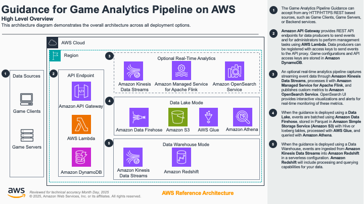

# Component Deep Dive

## Part 1. Ingest
Sending events to the Game Analytics Pipeline are through REST HTTPS API calls. 

## Part 2. Store

## Part 3. Process

## Part 4. Visualize

## Part 5. Manage