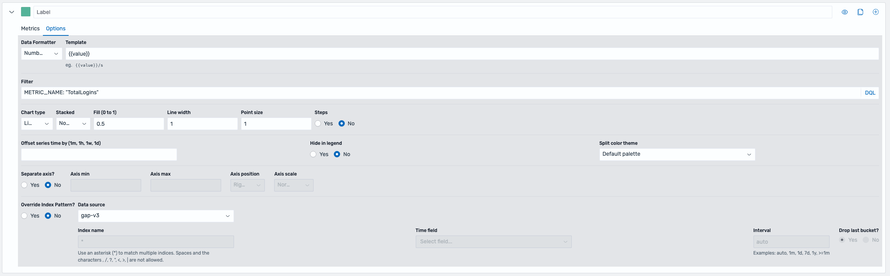

# Customizations

## Custom events + queries (sample walkthroughs)
    - non-real-time
    - real-time

## Custom ETL

### (Optional) Glue Iceberg Parameter Setup

If the data lake is configured with Apache Iceberg, Glue configuration parameters need to be specified to enable Apache Iceberg for Spark jobs. These can be specified under default parameters

- Create a new parameter with the key `--datalake-formats`. Set the value to be `iceberg`.

- Create a new parameter with the key `--enable-glue-datacatalog`. Set the value to be `true`.

- Create a new parameter with the key `--conf`. Set the value to be `spark.sql.extensions=org.apache.iceberg.spark.extensions.IcebergSparkSessionExtensions --conf spark.sql.catalog.glue_catalog=org.apache.iceberg.spark.SparkCatalog --conf spark.sql.catalog.glue_catalog.warehouse=s3://<ANALYTICS_S3_BUCKET_NAME>/ --conf spark.sql.catalog.glue_catalog.catalog-impl=org.apache.iceberg.aws.glue.GlueCatalog --conf spark.sql.catalog.glue_catalog.io-impl=org.apache.iceberg.aws.s3.S3FileIO`. 
    - Replace `<ANALYTICS_S3_BUCKET_NAME>` with the name of the created S3 bucket for analytics.

You can view more on setting up Iceberg with Glue jobs [here](https://docs.aws.amazon.com/glue/latest/dg/aws-glue-programming-etl-format-iceberg.html).

### Custom Real-Time Metrics

For live analytics, this solution deploys an Amazon Managed Service for Apache Flink application. This application utilizes PyFlink with the Flink Table API to build custom metrics using SQL. Please see the [Flink Table API Tutorial](https://nightlies.apache.org/flink/flink-docs-release-2.0/docs/dev/python/table_api_tutorial/) to learn more.

The pre-created job defines two streams, a source and a sink. These are defined using a [CREATE TABLE command](https://nightlies.apache.org/flink/flink-docs-stable/docs/dev/table/sql/create/) with the [Amazon Kinesis Data Streams SQL Connector](https://nightlies.apache.org/flink/flink-docs-release-1.20/docs/connectors/table/kinesis/).

The source reads from the input Kinesis data stream and the sink writes to the output Kinesis data stream. These streams are configured using variables loaded from the application's configured [runtime properties](https://docs.aws.amazon.com/managed-flink/latest/java/how-properties.md).

#### Source Stream Properties

- Since data is nested in the `event` JSON attribute of the message, the Flink [`ROW` data type](https://nightlies.apache.org/flink/flink-docs-stable/docs/dev/table/types/#constructured-data-types) is utilized to define known attributes and make them accessible using a dot notation. 
    - This is done for the attributes `event_version`, `event_id`, `event_type`, `event_name`, `event_timestamp`, and `event_data`.
- `event_data` contains a nested JSON object, of which has a user-defined schema that varies depending on the event. Since the schema changes dpeending on the event type, it is extracted as a [`STRING` data type](https://nightlies.apache.org/flink/flink-docs-stable/docs/dev/table/types/#character-strings). 
    - To retrieve values nested in the object, the [`JSON_VALUE` function](https://nightlies.apache.org/flink/flink-docs-stable/docs/dev/table/functions/systemfunctions/#json-functions) is used within aggregation queries.
- `rowtime` is retrieved explicitly from `event.event_timestamp` object and converted into a [`TIMESTAMP_LTZ` data type](https://nightlies.apache.org/flink/flink-docs-stable/docs/dev/table/types/#date-and-time) attribute. This makes the event time accessible for use in windowing functions. `rowtime` is used for [watermarking](https://nightlies.apache.org/flink/flink-docs-stable/docs/concepts/time/#event-time-and-watermarks) within Flink. 

## Modifying schema

## Modifying/extending architecture
- Allow both Redshift and non-redshift

## Modifying dashboards (ops and analytics)

### Configuring Access to OpenSearch UI 

The deployed OpenSearch Application can be configured to allow users access through SAML federation. 

For this, three components are needed:

1. Set up SAML Federation to connect your identity provider with the OpenSearch Interface. The federation must be set up to assume a created IAM role. The steps to do so can be found [here](https://docs.aws.amazon.com/opensearch-service/latest/developerguide/application-enable-SAML-identity-federation.html).

2. Update the IAM role that users will assume when accessing the dashboard. This role must have access to OpenSearch Serverless and OpenSearch UI. Example permissions for configuring OpenSearch Serverless can be found [here](https://docs.aws.amazon.com/opensearch-service/latest/developerguide/security-iam-serverless.html#security_iam_serverless_id-based-policy-examples), permissions to allow access to OpenSearch UI can be found [here](https://docs.aws.amazon.com/opensearch-service/latest/developerguide/application-getting-started.html#application-prerequisite-permissions).

3. Update the data access policy to grant the created IAM role permission to access the OpenSearch Serverless collection. More information on OpenSearch Serverless data access policies can be found [here](https://docs.aws.amazon.com/opensearch-service/latest/developerguide/serverless-data-access.html). 

After these steps are complete, users can use their logins to access the dashboard and create visualizations.

### Creating Visualizations and Dashboards with OpenSearch

The metric data stored in the OpenSearch index can be used to create visualizations which can be combined into dashboards. OpenSearch offers a [variety of visualizations](https://docs.opensearch.org/docs/latest/dashboards/visualize/viz-index/) as well as the [Dashboards Query Language (DQL)](https://docs.opensearch.org/docs/latest/dashboards/dql/) to filter data.

A strong visualization for metrics are time-series visualizations. These can be created using the [Time-Series Visual Builder (TSVB)](https://docs.opensearch.org/docs/latest/dashboards/visualize/tsvb/) visualization tool.

Since different metrics have different dimension data, it is strongly recommended to filter data for a specific metric name before proceeding with metric creation. This can be done using the DQL filter under options.
    

## (TODO: Send from game engines)

Utilize the integrated HTTP libraries in your game engine to form and send requests to the [Send Events API](./references/api-reference.md#post-send-events).

- [Unreal Engine 5](https://dev.epicgames.com/community/learning/tutorials/ZdXD/call-rest-api-using-http-json-from-ue5-c)

- [Unity](https://docs.unity3d.com/6000.1/Documentation/Manual/web-request.html)

- [Godot](https://docs.godotengine.org/en/stable/classes/class_httprequest.html)
