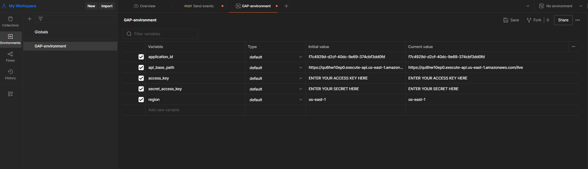
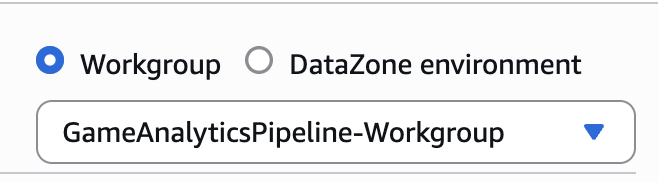
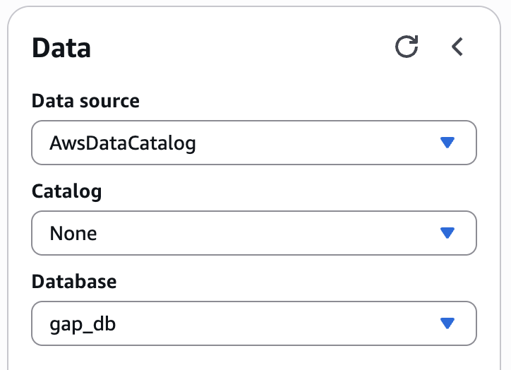
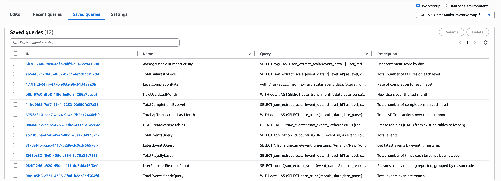
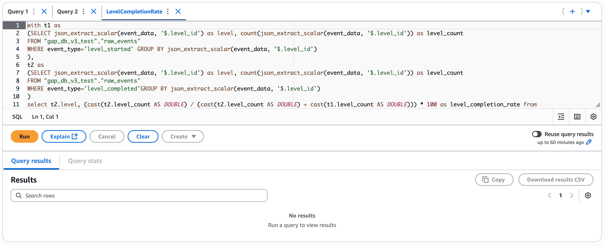
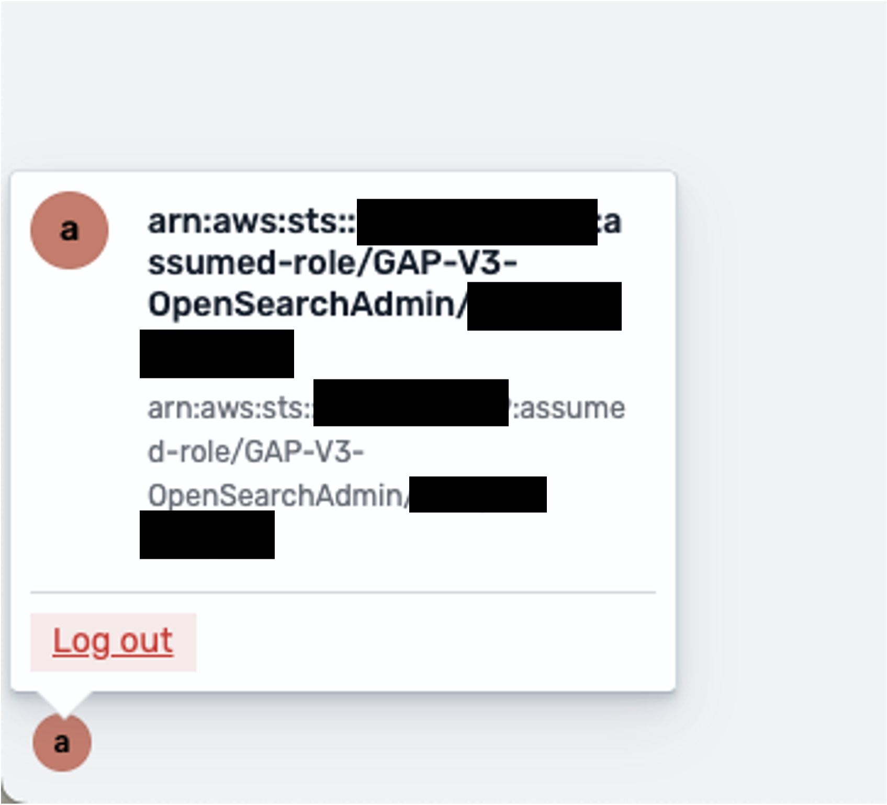
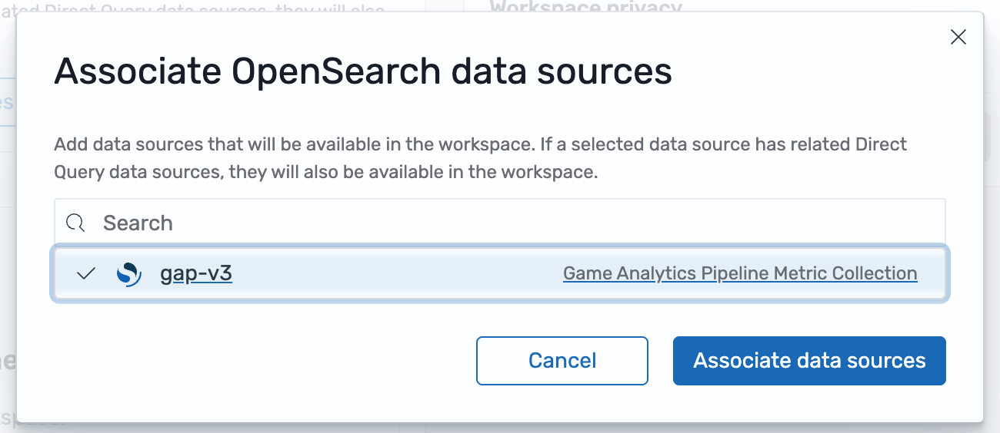
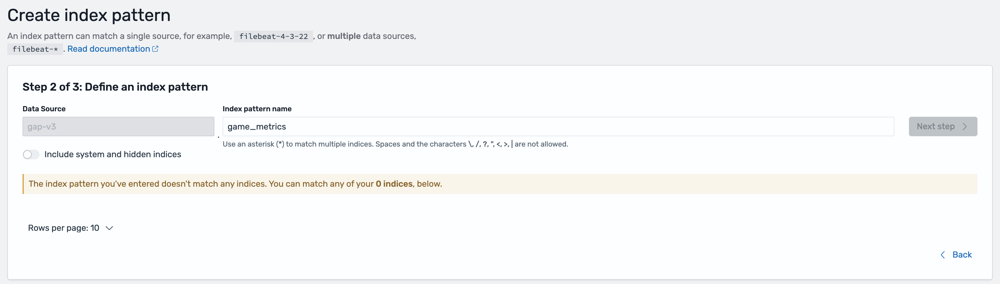

# Getting Started

This guide is intended for users integrating game analytics pipeline for the first time. If you have an existing Game Analytics Pipeline deployment and need to upgrade to the latest version, see the [Upgrading](./upgrading/v2-to-v3-changes.md) page.

---

## Prerequisites

The following resources are required to install, configure, and deploy the game analytics pipeline. 

- **Amazon Web Services Account**
- **[GitHub Account](https://docs.github.com/en/get-started/start-your-journey/creating-an-account-on-github)**
- **[Visual Studio Code](https://code.visualstudio.com/Download)\***
- **API Client: [Postman Desktop](https://www.postman.com/) or [Bruno](https://www.usebruno.com/)**
- **IAM Users + Credentials**
	- IAM User for deploying the guidance Infrastructure-as-Code resources
	- IAM User with AWS Console access
	- IAM User for administrating the API, requires [credentials (Access Key, Secret Access Key)](https://docs.aws.amazon.com/IAM/latest/UserGuide/id_credentials_access-keys.html)
!!! Info
	When using Access Keys and Secret Access Keys, a best practice is to periodically rotate them. This means your administrators and deployments will need to keep the rotation of your keys in mind as well, more information [here](https://docs.aws.amazon.com/IAM/latest/UserGuide/id-credentials-access-keys-update.html)

*\*Other code editors can also be used, but tooling support may be limited*

---

## Installation

1. Log into your GitHub account, and navigate to the the [Game Analytics Pipeline repository](https://github.com/aws-solutions-library-samples/guidance-for-game-analytics-pipeline-on-aws)

2. [Fork](https://docs.github.com/en/pull-requests/collaborating-with-pull-requests/working-with-forks/fork-a-repo) into your GitHub account

3. From your fork, [clone your repository](https://docs.github.com/en/repositories/creating-and-managing-repositories/cloning-a-repository) to a local folder on your machine

4. Navigate to the root of the local folder and open the project in your code editor

---

## Set up Environment

=== "Dev Container (Recommended)"

	A [development container](https://docs.github.com/en/codespaces/setting-up-your-project-for-codespaces/adding-a-dev-container-configuration/introduction-to-dev-containers) configuration contains the necessary *Python*, *NodeJS*, and the *AWS CDK* installations and versions needed to implement this guidance, which saves time installing manually. It is **recommended**, that you use the pre-configured [environment](https://code.visualstudio.com/docs/devcontainers/containers) as your development environment.

	To use Dev Containers, a container platform such as [Docker Desktop (local)](https://www.docker.com/products/docker-desktop/) or [Finch](https://runfinch.com/) must be installed and running.

	---

	#### Install the Dev Container Extension for VSCode

	1. Navigate to the [Dev Containers extension page](https://marketplace.visualstudio.com/items?itemName=ms-vscode-remote.remote-containers) in the Visual Studio Marketplace

	2. Click **Install** to add the extension to VSCode

	*\*Other code editors such as the [Jetbrains suite](https://plugins.jetbrains.com/plugin/21962-dev-containers) also support Dev Containers.*

	---

	#### (Optional) Configure VSCode to use Finch

	Finch is an open source client for container development. To use Finch, follow the [instructions in the Finch documentation](https://runfinch.com/docs/getting-started/installation/) to install and initialize Finch for your chosen operating system.

	After Finch is installed and running, follow the [instructions in the Finch documentation](https://runfinch.com/docs/integrations/devcontainers-on-finch/) to configure the Dev Container Extension to utilize Finch as the container platform to run the dev container for your chosen operating system.

	---

	#### Using the Dev Container

	After following the instructions in [Installation](#installation), when the project is opened in your code editor, a popup will appear indicating that the folder contains a dev container configuration. To utilize the Dev Container environment, click on “Reopen in Container”.

=== "Manual Install"

	Before deploying the sample code, ensure that the following required tools have been installed:

	- **[Docker Desktop (local)](https://www.docker.com/products/docker-desktop/) or [Finch](https://runfinch.com/)**
	- **[Apache Maven](https://maven.apache.org/install.html)**
	- **AWS Cloud Development Kit (CDK) 2.92 or Terraform**
	- **Python >=3.8**
	- **NodeJS >= 22.0.0**

	If Finch is installed, set the `CDK_DOCKER` environment variable to `finch`

	```bash
	CDK_DOCKER="finch"
	```

	This can also be added to the `~/.bashrc` file to be configured for every interactive shell. If you are using mac, replace `~/.bashrc` with `~/.zshrc `
	```bash
	echo 'CDK_DOCKER="finch"' >> ~/.bashrc 
	```

	!!! Warning
		The NPM commands to build and deploy the project are written to use UNIX shell commands. Because of this, **the manual install is incompatible with the Windows Powershell** without modifications to the NPM commands. Please consider using the Dev Container to have a consistent deployment environment.

---

## Configuration

The Game Analytics Pipeline can be deployed using [AWS Cloud Development Kit (CDK)](https://aws.amazon.com/cdk/) or [Terraform](https://developer.hashicorp.com/terraform). 

1. To select your deployment option, open the `package.json` file at the root of the repository. 

2. At the top of the `package.json` file there is a `"config"` block. Set the `"iac"` config option to `"cdk"` to use the CDK deployment option or `"tf"` to use the Terraform deployment option.

	```json
	"config": {
		"iac": "cdk" | "tf"
	},
	```
	!!! Warning
		Avoid changing this option after the stack is deployed without first destroying the created resources. 

3. Before deploying the sample code, deployment parameters need to be customized to suite your specific usage requirements. Guidance configuration, and customization, is managed using a `config.yaml` file, located in the infrastructure folder of the repository.

4. A configuration template file, called `config.yaml.TEMPLATE` has been provided as a reference for use case customizations. Using the provided devcontainer environment, run the following command to copy the template to  `./infrastructure/config.yaml`:
	```bash
	cp ./infrastructure/config.yaml.TEMPLATE ./infrastructure/config.yaml
	```

5. Open the `./infrastructure/config.yaml` file for editing. Configure the parameters for the pipeline according to the options available in the [Config Reference](./references/config-reference.md).

6. Terraform Only - Terraform does not use a default region like CDK does, and needs to specify the region in the providers file (`./infrastructure/terraform/src/providers.tf`). It is defaulted to `us-east-1` but please modify the below section on the file to your desired region code:

	```json
	provider "aws" {
	region = "REGION"
	}
	```

---

### CDK Only - Configuring ESBuild

This repository utilizes L2 constructs for Nodejs based lambda functions. These constructs handle the bundling of lambda code for deployment. By default, the construct will utilize a Docker container to compile the function, however, this option leads to high build times before each deployment and can have increased performance impacts on MacOS and docker-in-docker enviornments. If `esbuild` is installed, the L2 construct will build the function using `esbuild` instead which leads to faster build times.

To install `esbuild`, navigate to the root of the repository and enter the following command:

```bash
npm install .
```

`esbuild` is listed as a development dependency under `package.json` and will be installed.

---

### AWS CLI Configuration

The AWS CLI must be properly configured with credentials to your AWS account before use. The `aws configure` or `aws configure sso` commands in your development enviornment terminal are the fastest way to set up your AWS CLI depending on your credential method. Based on the credential method you prefer, the AWS CLI prompts you for the relevant information. 

More information about the aws configure command can be found in the documentation for the [AWS Command Line Interface](https://docs.aws.amazon.com/cli/latest/userguide/getting-started-quickstart.html#getting-started-quickstart-new).

---

## Deployment

!!! Info
    **Security credentials for the target AWS account must be configured** on the machine before deploying the pipeline. This lets AWS know who you are and what permissions you have to deploy the pipeline. These credentials must have permissions to create new resources within the account, including new IAM Roles.

    There are different ways in which you can configure programmatic access to AWS resources, depending on the environment and the AWS access available to you. Please consult the following documentation based on your deployment option to configure the credentials before proceeding with this section.

    - [AWS Cloud Development Kit (CDK)](https://docs.aws.amazon.com/cdk/v2/guide/configure-access.html)

    - [HashiCorp Terraform](https://registry.terraform.io/providers/hashicorp/aws/latest/docs#authentication-and-configuration)

Once you have set your own custom configuration settings, and saved the config.yaml file, then following steps can be used to deploy the game analytics pipeline:

1. Build the sample code dependencies, by running the following command:
```bash
npm run build
```
2. Bootstrap the sample code, by running the following command:
```bash
npm run deploy.bootstrap
```
3. Deploy the sample code, by running the following command:
```bash
npm run deploy
```
After deployment is complete, a list of outputs will be posted to the terminal. These are names and references to relevant deployed assets from the stack. Please note these for future reference.

---

## Start initial Application and API

Before sending events to the pipeline, an Application and corresponding Authorization key will need to be created. A Postman collection file is provided to help configure Postman or Bruno for use with the solution. 

1. Locate the [API Endpoint](./references/output-reference.md#api-endpoint) from the output after deployment. Note this down for the collection
	- If deployed using CDK, this endpoint is the value of `CentralizedGameAnalytics.ApiEndpoint`. 
	- If deployed using Terraform, this endpoint is the value of `api_endpoint`
2. The collection file is located at `/resources/game-analytics-pipeline-postman-collection.json`

=== "Postman"

	1. For instructions on how to import a collection, refer to the documentation for your selected API Client: [Import Postman data](https://learning.postman.com/docs/getting-started/importing-and-exporting/importing-data/#import-postman-data)
	2. Once the collection is imported into Postman, create a new environment by selecting Environments in the sidebar and select the Add icon. You can also select the environment selector at the top right of the workbench and select Add icon. Enter a name for your new environment.
	3. In order to perform administrator actions on your API, Authentication must be configured to utilize SigV4 authentication for an IAM identity. These credentials inherit from your `access_key` and `secret_access_key` variables configured in the collection. For more information, refer to [Authenticate with AWS Signature authentication workflow in Postman](https://learning.postman.com/docs/sending-requests/authorization/aws-signature/)
	4. Replicate the following image for your environment (Note: leave `application_id` blank. This will be filled in later):
		- The AWS Access Key and Secret Access Key is specifically for administrating the API only, and should not be used by event sources. You should have an IAM User specifically with these credentials with sufficient permissions to run the tasks on the API, but for security best practice to use least privilege, a sample policy is created by the guidance `{WORKLOAD_NAME}-AdminAPIAccess` to attach to the user to perform only the admin tasks
		
	5. Ensure there are no trailing return/enter spaces at the end of the variables, and click "Save" on the top right.
	6. Select your newly created and saved environment by navigating to the top right drop-down menu that says `No environment`, selecting on it and selecting your new environment

=== "Bruno"

	1. For instructions on how to import a collection, refer to the documentation for your selected API Client: [Importing Enviornment into Bruno](https://docs.usebruno.com/get-started/import-export-data/postman-migration#importing-environment-into-bruno)
	2. Once the collection is imported into your API client, navigate to the Vars tab for the collection. 
		- Validate that five variables (`api_base_path`, `application_id`, `access_key`, `secret_access_key`, and `region`) are under Pre Request variables. If they are not, create variables with those names.
		- Configure the collection-wide `api_base_path` variable to be your deployed API base path. The value of the path should be the URL retrieved from step 1.
		- Configure `region` to be the region where the stack is deployed
		- Configure `access_key` to be the access key of the identity used to deploy the stack
		- Configure `secret_access_key` to be the secret access key of the identity used to deploy the stack
		- Leave `application_id` blank. This will be filled in later.
	4. Ensure the collection variables are created

		

	4. In order to perform administrator actions on your API, Authentication must be configured to utilize SigV4 authentication for an IAM identity. These credentials inherit from your `access_key` and `secret_access_key` variables configured in the collection. For more information, refer to  [Authenticate using AWS Signature](https://docs.usebruno.com/auth/aws-signature)
		- If a session token is needed for temporary credentials, please add them manually
	5. Ensure there are no trailing return/enter spaces at the end of the variables. Save the configuration by pressing `ctrl + s` (or `cmd + s` on mac).


After the pipeline is deployed, a new application must be created using the Application API. 

### Create a new Application

The Game Analytics Pipeline Guidance is built to support multiple games, called `Applications` in the guidance, for cross-game and per-game analytics. This means usually you would only need to deploy a single pipeline per environment.

- Navigate under the **Applications** tab of the collection and select the **Create Application** API. 
- Navigate to the `Body` tab (under the address bar showing the API path) and modify the value of Name and Description in the json to match your game.
- Send the API request. **Note the value of the `"ApplicationId"` in the API response.**
- Copy the value of the ApplicationId and paste it in to the `application_id` value for the collection. This will allow the rest of your API calls to interact with the application
!!! Note
	Refer to the [API Reference for POST - Create Application](./references/api-reference.md#post---create-application) for more information on how to register a new application. 

After the application is created, create an API key to send events to the API. Make sure to go back to Postman or Bruno if you are using them to update the environment variables (and save).

### Create a new API Key

- Navigate under the **Authorizations** tab of the collection and select the **Create Authorization** API.
- The `"ApplicationId"` from the previous step should be passed in the API path automatically. 
- Navigate to the `Body` tab (under the address bar showing the API path) and modify the value of Name and Description in the json to match your game.
- Send the API request. **Note the value of the `"ApiKeyValue"` in the API response.**
- Refer to the [API Reference for POST - Create API Key for Application](./references/api-reference.md#post---create-api-key-for-application) for more information on how to create a new authorization key. 

If you have Redshift Mode enabled, enable the materialized views and remaining infrastructure through the API. Refer to the [API Reference for POST - Setup Redshift](./references/api-reference.md#post-set-up-redshift) on how to setup the final Redshift components.

---

### Apache Iceberg Only - Configure Table Partition Spec

If the `ENABLE_APACHE_ICEBERG_SUPPORT` configuration is set to `true`, a basic Apache Iceberg table is created in the glue catalog with the table name specified with `RAW_EVENTS_TABLE` under the database specified with `EVENTS_DATABASE`. 

By default, this table does not contain a configured partition specification. To enable partitioning, a Glue job must be run before data is ingested to configure the table.

1. Locate the [Iceberg Setup Job Name](./references/output-reference.md#iceberg-setup-job-name) from the deployment outputs. Note this down for later.
	- The name of the job is the value of `CentralizedGameAnalytics.IcebergSetupJobName` when using CDK.
	- The name of the job is the value of `iceberg_setup_job_name` when using Terraform.
2. Navigate to the [Glue AWS Console](http://console.aws.amazon.com/glue). Ensure that you are in the same region that the stack is deployed in
3. On the left sidebar, navigate to ETL jobs
4. Locate the deployed setup job with the name retrieved from Step 1 in the list of jobs. Use the search bar if necessary
5. Click on the checkbox to the left of the name of the job. 
6. Click on **Run job** at the top right of the job list to start the job. 
7. Navigate to the job run status using the popup at the top of the page. Monitor the status until the job is complete and successful.

---

### Real Time Only - Starting Flink

If the `REAL_TIME_ANALYTICS` configuration is set to `true`, a Flink Application will be created. This application needs to be in the `RUNNING` state for incoming events to be processed in real time. 

1. Locate the [Flink App Name](./references/output-reference.md#flink-app-name) from the deployment outputs. Note this down for later.
	- The name of the job is the value of `CentralizedGameAnalytics.FlinkAppName` when using CDK.
	- The name of the job is the value of `flink_app_name` when using Terraform.

2. Navigate to the AWS Console. Open the console for [Managed Apache Flink](https://console.aws.amazon.com/flink)

3. Click on the **Apache Flink applications** page on the side menu. 

4. Navigate to the application with the name matching the one retrieved from the step 1 output.

5. Click on the **Run** button at the top right of the menu. Configure the Snapshots option to **Run without snapshot** when starting for the first time. Click on the **Run** button again to start the application.

6. Wait for the Status to show as **Running**

For more information and troubleshooting, refer to the documentation for [Run a Managed Service for Apache Flink application](https://docs.aws.amazon.com/managed-flink/latest/java/how-running-apps.html).

---


## Send Events to the Pipeline

This project contains a python script to send a simulated stream of events to the pipeline. The script is located at `resources/publish-data/handler.py`. To run the script, run the following
```bash
python resources/publish-data/handler.py --api-path <API_PATH> --api-key <API_KEY> --application-id <APPLICATION_ID>
```


- Replace `<API_PATH>` with the value of the API endpoint retrieved after deployment during step 1 of [Start initial Application and API](#start-initial-application-and-api)
- Replace `<APPLICATION_ID>` with the value of `"ApplicationId"` created during the [Create a new Application step](#create-a-new-application).
- Replace `<API_KEY>` with the value of `"ApiKeyValue"` created during the [Create a new API Key step](#create-a-new-api-key).


For more information, refer to the [API Reference for POST - Send Events](./references/api-reference.md#post-send-events) for the REST API schema to send events to the pipeline.

---

## Verify and Query Event Data

=== "Data Lake Mode"

	1. Navigate to the [AWS Console for Athena](console.aws.amazon.com/athena)

	2. If you are not already on the query editor, click on the **Launch query editor** button

	3. At the top left of the editor, select the workgroup for your stack. The name should consist of the name specified by `WORKLOAD_NAME` in config.yaml followed by the suffix `-workgroup` and a random suffix.

		

	4. Acknowledge the settings for the workgroup

	5. On the left hand side, select the Database with the name specified by `EVENTS_DATABASE` in config.yaml

		

	6. A list of tables should appear below the selection. Select a table, click the three buttons on the left, and select **At** to see the items in the table.

		

	7. To use the pre-defined queries, select Saved queries at the top toolbar of the query editor. This will show a list of queries created for the stack. 

		
	
	8. To run a query, click on the highlighted ID of the query to open it in a new query editor tab and then press Run for the query. View the results below after the query finishes executing.

		

=== "Redshift Mode"

	1. In the AWS Console, navigate to [Redshift](http://console.aws.amazon.com/redshift) and you will see the Serverless Dashboard.

		

	2. Select your namespace and then press the Query Editor button in the top right.

		

	3. In the Query Editor, you will see your namespace in the top left.

		

	4. Select the ... to the right of the name to create a connection. Choose Secrets Manager and the relevant secret.

		

	5. Navigate to `native databases / events / Views`

		

	6. Double click one of the views to automatically open a query in the editor on the right side. Edit the query and press Run when ready.

	7. The view event_data is the materialized view which reads directly from the Kinesis Data Stream. The other views are essentially pre-made queries against the event_data materialized view.

=== "Real-Time Analytics"

	If `REAL_TIME_ANALYTICS` is set to `true`, an OpenSearch Serverless collection will be created to store and index the time series metrics emitted by the Managed Service for Apache Flink application that is initiated in the [Starting Flink](#real-time-only---starting-flink) step. 

	An acccompanying [OpenSearch UI Application](https://aws.amazon.com/blogs/big-data/amazon-opensearch-service-launches-the-next-generation-opensearch-ui/) is created to query and visualize the data emitted by real time analytics. To access this application, ensure you are logged in to the AWS console in your browser of choice with the created OpenSearch Admin IAM role.

	1. Ensure you are logged in to the AWS console with an existing administrator IAM role. This account must have the `sts:AssumeRole` permission to [switch roles](https://docs.aws.amazon.com/IAM/latest/UserGuide/id_roles_use_permissions-to-switch.html).
	2. Locate the [OpenSearch Admin Assume Link](./references/output-reference.md#opensearch-admin-assume-link) to assume the IAM role from the output of the deployed stack. 
		- If deployed using CDK, this output is identified by `CentralizedGameAnalytics.OpenSearchAdminAssumeLink`. 
		- If deployed using Terraform, this output is identified by `opensearch_admin_assume_link`
	3. Paste the link into your browser of choice, confirm the details are correct, and click **Switch Role** to assume the admin role. The assumed role should have the name of your configured `PROJECT_NAME` followed by `-OpenSearchAdmin`.
		
	4. Verify that you have assumed the admin IAM role by checking the role at the top right of the AWS console.
	5. Locate the [OpenSearch Dashboard Link](./references/output-reference.md#opensearch-dashboard-link) to the OpenSearch application from the output of the deployed stack. 
		- If deployed using CDK, this output is identified by `CentralizedGameAnalytics.OpenSearchDashboardLink`. 
		- If deployed using Terraform, this output is identified by `opensearch_dashboard_link`
	6. Paste the link into your browser of choice. Ensure that you are logged in to the AWS console as the OpenSearch Admin before proceeding. 
	7. On the main dashboard page, verify that you are logged in as the OpenSearch Admin by clicking on the "a" icon on the bottom right and viewing the associated role.
		{ width="300" }
	8. On the main dashboard page, click on **Create workspace** under Essentials
		
	9. On the next page, provide a name and description to the workspace
	5. Under Associate data sources, click **Associate OpenSearch data sources**
		
	10. Select the Game Analytics Pipeline Metric Collection and click **Associate data sources**
		
	11. If needed, change the visibility of the workspace in the last section
	12. Click Create workspace
	13. On the left side, select **Index patterns** and click **Create index pattern**
		
	14. Select the associated data source and click Next
	15. In the field for Index pattern name, enter `game_metrics*`
		
	16. Create the index pattern and verify the fields of the index
		
	17. View the raw data stored in the index by navigating to the **Discover** tab on the left. If there is no data shown, adjust the time window using the control at the top right. 
		

	Using the created game_metrics index pattern you can create time series visualizations of the real-time metrics.

---

## Next Steps

- [Customizations](customizations.md)
- [Troubleshooting](troubleshooting.md)
- [References](references/api-reference.md)