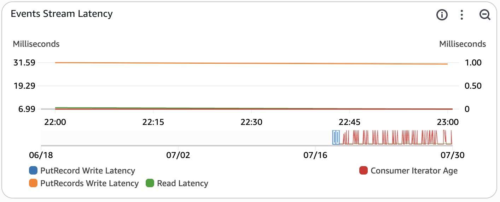
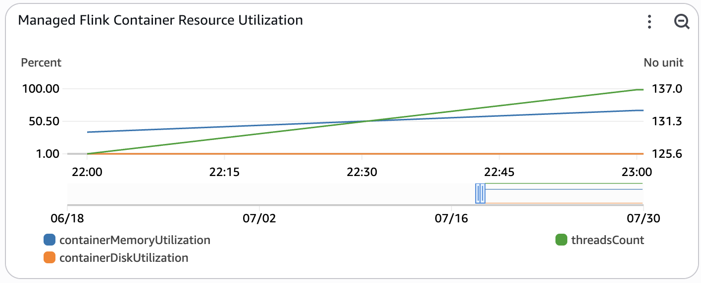

The Operational Dashboard is a CloudWatch dashboard used to monitor the health of the deployed game analytics pipeline. The contents of the dashboard can change based on the configurations of the deployed pipeline specified in the [config.yaml file](./config-reference.md). For more information about CloudWatch dashboards, please refer to the [Amazon CloudWatch User Guide](https://docs.aws.amazon.com/AmazonCloudWatch/latest/monitoring/CloudWatch_Dashboards.html).

## Operational Health

### Events Ingestion and Delivery
{ width="500" }

This widget monitors the total number of REST API Calls to ingest events into the game analytics pipeline within the time period. Each REST API call may contain multiple events per payload. The time period for this metric is set to automatic based on the period configured for the entire dashboard.

## Kinesis Data Stream Ingestion

### Events Ingestion and Delivery
{ width="500" }

This widget monitors the total number of individual events sent to the real-time kinesis data stream within the time period. The time period for this metric is set to automatic based on the period configured for the entire dashboard. This widget is enabled only if [`INGEST_MODE` is set to `KINESIS_DATA_STREAMS`](./config-reference.md#data-platform-options).

### Events Stream Latency
{ width="500" }

This widget monitors the latency of the real-time raw event data stream. This widget is enabled only if [`INGEST_MODE` is set to `KINESIS_DATA_STREAMS`](./config-reference.md#data-platform-options).

- **PutRecords Write Latency** - this measures the average latency in milliseconds of the PutRecords operation (multi record insert) within the time period. This metric is used to monitor the latency of inserts into the pipeline. The time period for this metric is set to automatic based on the period configured for the entire dashboard.
- **Read Latency** - this measures the average latency of a read operation in milliseconds from the Kinesis Data Stream within the time period. This metric is used to monitor the latency of a read request by the consumers of raw events (Amazon Data Firehose, Amazon Managed Service for Apache Flink, Amazon Redshift). The time period for this metric is set to automatic based on the period configured for the entire dashboard.
- **Consumer Iterator Age** - this tracks the average read position of the data being processed by a downstream consumer (Amazon Data Firehose, Managed Service for Apache Flink app). If the iterator age passes 50% of the configured stream retention period, there is a risk for data loss. This metric can occasionally spike if the pipeline is idle. The time period for this metric is set to automatic based on the period configured for the entire dashboard.
- **PutRecord Write Latency** - this measures the average latency of the PutRecord operation (single record insert) within the time period. This metric is often not published as the API Gateway batches events using the PutRecords API by default. The time period for this metric is set to automatic based on the period configured for the entire dashboard.

You can read more about Kinesis stream-level metrics in the [Amazon Kinesis Data Streams Developer Guide](https://docs.aws.amazon.com/streams/latest/dev/monitoring-with-cloudwatch.html#kinesis-metrics-stream) and troubleshooting using the metrics in the [troubleshooting documentation](https://docs.aws.amazon.com/streams/latest/dev/troubleshooting-consumers.html).

## Redshift Serverless

### Queries Completed Per Second

{ width="500" }
	
This widget tracks the number of queries completed per second.

For more information about the metrics that Redshift Serverless tracks, please refer to the [Amazon Redshift Management Guide](https://docs.aws.amazon.com/redshift/latest/mgmt/serverless-audit-logging.html).

### Database Connections

{ width="500" }

This widget tracks the number of open connections to the Redshift database at a point in time.

For more information about the metrics that Redshift Serverless tracks, please refer to the [Amazon Redshift Management Guide](https://docs.aws.amazon.com/redshift/latest/mgmt/serverless-audit-logging.html).

### Query Planning / Execution

{ width="500" }

This widget tracks the time spent planning and executing queries on the event data.

- **QueryPlanning** - This metric tracks the time spent parsing and optimizing SQL statements.
- **QueryExecutingRead** - This metric tracks the time spent executing read queries.

For more information about the metrics that Redshift Serverless tracks, please refer to the [Amazon Redshift Management Guide](https://docs.aws.amazon.com/redshift/latest/mgmt/serverless-audit-logging.html).

### Data Storage

{ width="500" }

This widget tracks the amount of data stored in the Redshift serverless data.

For more information about the metrics that Redshift Serverless tracks, please refer to the [Amazon Redshift Management Guide](https://docs.aws.amazon.com/redshift/latest/mgmt/serverless-audit-logging.html).

## Stream Ingestion & Processing

### Events Processing Health
{ width="500" }

This widget monitors the firehose delivery stream used to deliver raw events to the data lake.

- **Data Freshness** - This metric monitors the average age of the oldest record in Amazon Data Firehose that has not been delivered into Amazon S3 within the time period. The age is defined as the time difference from ingestion until current time. Any records with an age higher than this metric have been delivered into S3. The time period for this metric is set to automatic based on the period configured for the entire dashboard.
- **Firehose Records Delivered to S3** - This measures the average number of game events that have been delivered into Amazon S3 within the time period. The time period for this metric is set to automatic based on the period configured for the entire dashboard.
- **Lambda Duration** - This measures the average amount of time that the lambda spends processing an event for data transformation using Amazon Data Firehose within the time period. The time period for this metric is set to automatic based on the period configured for the entire dashboard.
- **Lambda Concurrency** - This measures the highest number of concurrent lambdas executing for data transformation using Amazon Data Firehose within the time period. The time period for this metric is set to automatic based on the period configured for the entire dashboard. If this metric exceeds the quota for the region or the reserved concurrency limit for the function, requests will become throttled.
- **Lambda Throttles** - This measures the total number of throttled requests to the data transformation lambda within the time period. The time period for this metric is set to automatic based on the period configured for the entire dashboard.

You can view more about the metrics emitted by Amazon Data Firehose in the [Amazon Data Firehose Developer Guide](https://docs.aws.amazon.com/firehose/latest/dev/monitoring-with-cloudwatch-metrics.html).

### Event Transformation Lambda Error count and success rate (%)
{ width="500" }

This widget monitors the activity on the transformation lambda function used in Amazon Data Firehose.

- **Errors** - This metric tracks the total number of invocations resulting in function errors within the time period.
- **Invocations** - This metric tracks the total number of function invocations within the time period.
- **Success Rate (%)** - This metric tracks the percentage of lambda invocations that were successful within the time period. This metric is tracked on the right axis of the graph as it measures percentage instead of count.

You can view more about Lambda function metrics in the [AWS Lambda Developer Guide](https://docs.aws.amazon.com/lambda/latest/dg/monitoring-metrics-types.html).

## Real-time Streaming Analytics

### Managed Flink Records Intake
{ width="500" }

This widget monitors the number of records that the Managed Service for Apache Flink application is recieving from the input stream. This metric is only enabled when [`REAL_TIME_ANALYTICS` is set to `true`](./config-reference.md#data-platform-options).

- **Number of Records Recieved** - This metric tracks total number of records that the Managed Service for Apache Flink application has recieved within the time window.
- **Number of Late Records Dropped** - This metric tracks total number of records that the  Managed Service for Apache Flink application has dropped due to arriving late.

For more information about the metrics the Managed Service For Apache Flink tracks, please refer to the [developer guide](https://docs.aws.amazon.com/managed-flink/latest/java/metrics-dimensions.html).

### Managed Flink Container CPU Utilization
{ width="500" }

This widget monitors the container CPU utilization of the Managed Service for Apache Flink application. Container CPU utilization is the metric used to determine auto-scaling actions for the Managed Service for Apache Flink application which are annotated on the graph. This metric is only enabled when [`REAL_TIME_ANALYTICS` is set to `true`](./config-reference.md#data-platform-options).

If this metric is above the Scale Up Threshold for 15 minutes or more, an auto-scaling action will be triggered to double the parallelism of the application. If this metric is below the Scale Down Threshold for six hours or more, an auto-scaling action will be triggered to halve the parallelism of the application. You can read more about Flink autoscaling in the [Developer Guide for Managed Service for Apache Flink](https://docs.aws.amazon.com/managed-flink/latest/java/how-scaling-auto.html). 

### Managed Flink Container Resource Utilization
{ width="500" }

This widget monitors resource utilization of the Managed Service for Apache Flink application. These resources are not used for auto-scaling, but are important to monitor for performance regressions. This metric is only enabled when [`REAL_TIME_ANALYTICS` is set to `true`](./config-reference.md#data-platform-options).

- **threadsCount** - The total number of live threads used by the application.	
- **containerMemoryUtilization** - Overall percentage of memory utilization across task manager containers in Flink application cluster.
- **containerDiskUtilization** - Overall percentage of disk utilization across task manager containers in Flink application cluster.

For more information about the metrics the Managed Service For Apache Flink tracks, please refer to the [developer guide](https://docs.aws.amazon.com/managed-flink/latest/java/metrics-dimensions.html).

### OpenSearch Intake
{ width="500" }

This widget monitors the flow of custom metric documents that are ingested into OpenSearch Serverless. The left side of the widget monitors successful records ingested, while the right side of the widget monitors documents that errored out during ingestion. This metric is only enabled when [`REAL_TIME_ANALYTICS` is set to `true`](./config-reference.md#data-platform-options).

- **Collection Ingested** - The number of records at which documents are being ingested to the OpenSearch Serverless Collection.
- **Pipeline Recieved** - The number of records at which documents are being ingested into the OpenSearch Ingestion pipeline.
- **Pipeline Sent** - The number of documents successfully sent from the OpenSearch Ingestion pipeline to the OpenSearch Collection.
- **Pipeline Errors** - The number of documents that failed to be sent from the OpenSearch Ingestion pipeline.
- **Collection Errors** - The total number of document errors during ingestion into the OpenSearch Serverless Collection. After a successful bulk indexing request, writers process the request and emit errors for all failed documents within the request.

For more information about the metrics emitted by Amazon OpenSearch Serverless, refer to the [developer guide](https://docs.aws.amazon.com/opensearch-service/latest/developerguide/monitoring-cloudwatch.html). For more information about the metrics emitted by Amazon OpenSearch Ingestion, refer to the [developer guide on pipeline metrics](https://docs.aws.amazon.com/opensearch-service/latest/developerguide/monitoring-pipeline-metrics.html).

### Metrics Stream Latency
{ width="500" }

This widget monitors the latency of the custom metrics stream. The custom metrics stream contains metrics created by the Managed Service for Apache Flink Application in flight to OpenSearch. This metric is only enabled when [`REAL_TIME_ANALYTICS` is set to `true`](./config-reference.md#data-platform-options).

- **PutRecords Write Latency** - this measures the average latency in milliseconds of the PutRecords operation (multi record insert) within the time period. This metric is used to monitor the latency of inserts into the pipeline. The time period for this metric is set to automatic based on the period configured for the entire dashboard.
- **Read Latency** - this measures the average latency of a read operation in milliseconds from the Kinesis Data Stream within the time period. This metric is used to monitor the latency of a read request by the consumers of raw events (Amazon Data Firehose, Amazon Managed Service for Apache Flink, Amazon Redshift). The time period for this metric is set to automatic based on the period configured for the entire dashboard.
- **Consumer Iterator Age** - this tracks the average read position of the data being processed by a downstream consumer (Amazon Data Firehose, Managed Service for Apache Flink app). If the iterator age passes 50% of the configured stream retention period, there is a risk for data loss. This metric can occasionally spike if the pipeline is idle. The time period for this metric is set to automatic based on the period configured for the entire dashboard.
- **PutRecord Write Latency** - this measures the average latency of the PutRecord operation (single record insert) within the time period. This metric is often not published as the Flink connector batches events using the PutRecords API by default. The time period for this metric is set to automatic based on the period configured for the entire dashboard.

You can read more about Kinesis stream-level metrics in the [Amazon Kinesis Data Streams Developer Guide](https://docs.aws.amazon.com/streams/latest/dev/monitoring-with-cloudwatch.html#kinesis-metrics-stream) and troubleshooting using the metrics in the [troubleshooting documentation](https://docs.aws.amazon.com/streams/latest/dev/troubleshooting-consumers.html).

### OpenSearch Latency
{ width="500" }

This widget monitors the end-to-end latency of the system used to ingest custom metrics from the custom metrics stream into OpenSearch. This metric is only enabled when [`REAL_TIME_ANALYTICS` is set to `true`](./config-reference.md#data-platform-options).

- **Collection Ingestion Request Latency** - The average latency for bulk write operations to the Amazon OpenSearch Serverless collection within the time period.
- **Pipeline End-To-End Latency** - The average end-to-end latency of the Amazon OpenSearch Ingestion pipeline. This measures the total latency of the ingestion pipeline as it recieves and buffers events before delivering them to the collection. If this metric is high, consider increasing the OCU limit of the pipeline to increase parallelism.

For more information about the metrics emitted by Amazon OpenSearch Serverless, refer to the [developer guide](https://docs.aws.amazon.com/opensearch-service/latest/developerguide/monitoring-cloudwatch.html). For more information about the metrics emitted by Amazon OpenSearch Ingestion, refer to the [developer guide on pipeline metrics](https://docs.aws.amazon.com/opensearch-service/latest/developerguide/monitoring-pipeline-metrics.html).