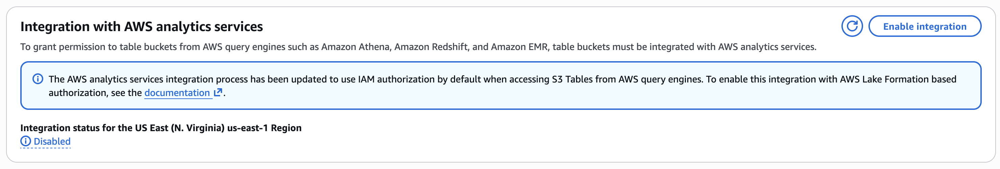
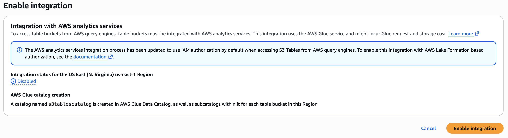
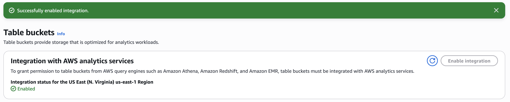
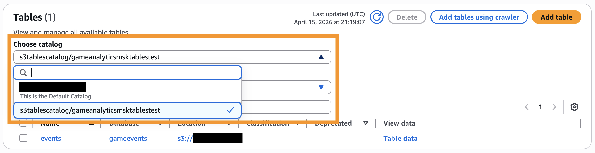
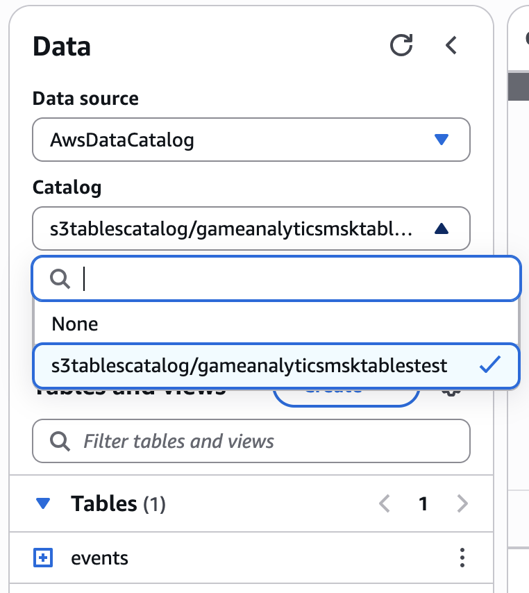

# Configuring S3 Tables

## How GAP Uses S3 Tables

The Guidance interacts Amazon S3 Tables through managed services (Amazon Athena, Amazon Data Firehose, Amazon Glue). For these services to access the event data stored in Amazon S3 Tables, the [Integration with AWS analytics services](https://docs.aws.amazon.com/AmazonS3/latest/userguide/s3-tables-integrating-aws.html) has to be enabled. 

By default, the services created by GAP are configured to utilize IAM policies for access control. By default, Lake Formation is not utilized in this solution.

## Steps

Navigate to the [S3 Tables console](https://console.aws.amazon.com/s3/table-buckets). Ensure that you are in the region where you will be deploying the game analytics pipeline.

At the top there is a message to enable the AWS Services Integration. If you have not previously enabled the integration the status on the message will say *Disabled*. If the integration is disabled, enable the integration by clicking the **Enable Integration** button.

!!! Note
    This is an region-wide setting. Turning on this setting will enable the integration for all S3 Tables buckets in the region where you are deploying GAP. We do not automate this process in the infrastructure as code due to its potential effects on other resources in the account. Please refer to the [AWS Documentation](https://docs.aws.amazon.com/AmazonS3/latest/userguide/s3-tables-integrating-aws.html) for more information about the integration before proceeding. 

Proceed with enabling the integration by clicking the **Enable Integration** button.

After the integration is enabled, you will be navigated back to the S3 Tables console. Check the message to make sure the status of the integration is set to *Enabled*.

## Accessing the Game Analytics Pipeline S3 Tables resources

To view your data tables in the [Glue data catalog console](https://console.aws.amazon.com/glue/home/), set the Choose catalog value to be the catalog named `s3tablescatalog/WORKLOAD_NAME` where `WORKLOAD_NAME` is replaced with the value provided in the config. 

To query your data in the Athena query editor, make sure the Catalog is set to `s3tablescatalog/WORKLOAD_NAME` where `WORKLOAD_NAME` is replaced with the value provided in the config instead of `None`.

{ width="500" }

## Troubleshooting

If you previously enabled the S3 Tables Integration your table may have been configured to utilize Lake Formation to provide services access to the data lake. Please refer to the **Migrating to the updated integration process** section in the [AWS documentation](https://docs.aws.amazon.com/AmazonS3/latest/userguide/s3-tables-integrating-aws.html#table-integration-procedures) to migrate to the new IAM permissions configuration to ensure the deployment works properly.

By default, the Game Analytics Pipeline configures the name of the created S3 Tables table bucket to be the `WORKLOAD_NAME` parameter. Please refer to the [S3 Tables naming rules](https://docs.aws.amazon.com/AmazonS3/latest/userguide/s3-tables-buckets-naming.html) when configuring the parameter.