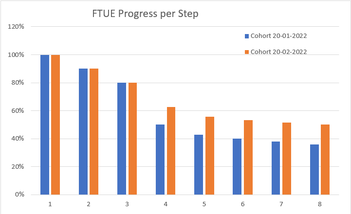
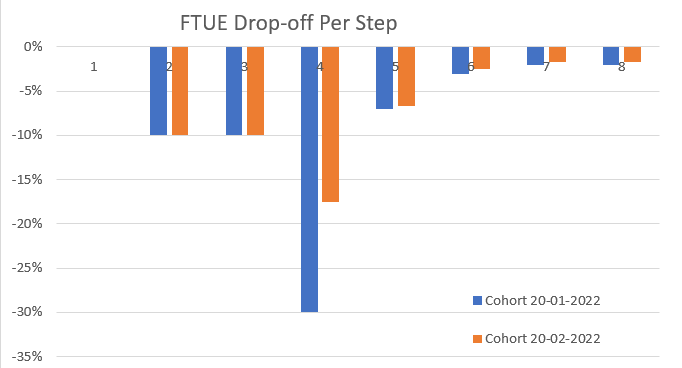

# Anonymous Game Telemetry Design Recommendations

## Purpose

There are situations where a game may not be able to identify or discern unique players (web games, public exhibitions, etc), which makes classical game KPIs like daily active users and retention impossible. This document summarizes recommendations for new KPIs and telemetry design to enable game management within such constraints.

## Game Management Goals

These recommendations will enable game developers to derive actionable, aggregate information about their players' behaviors while preserving player privacy. Game developers will be able to identify player progression blockers, quantify effects of game updates

## Common Telemetry Event Fields

While it is not possible to link individual sessions to unique users, it is possible to enumerate sessions for a user in the game client or game server, so that telemetry reports each session as being first, second, third, 20th, etc.

This session sequence number should be attached to all telemetry events.

| Event Name | Field | Type | Example |
| --- | --- | --- | --- |
| <all> | session_num | int | On 5th launch of game client on the player's device, send '5' in this field for all events triggered during the session. |
| <all> | sid | string | Unique session ID guid to link events from the same session, should be constant for the duration of a session. |
| <all> | playtime_to_date_sec | float | If available, total sum of player lifetime playtime in seconds up to this event. |
| <all> | first_session_date | timestamp | The (valid internet time) timestamp of the game client's first session. This can be remembered in client's local data store or retrieved from the game server if available. |

## Sequential Session Activity Tracking

In addition, a session start event should be sent at the start of every session, to initialize each session, even if it's too short to have other events.

| Event Name | Field | Type | Example / Comment |
| --- | --- | --- | --- |
| session_start | <common fields> | | |
| event_time | timestamp | UTC (or customer preferred timezone) date/time the event took place (must be server-authoritative) | |
| session_time_sec | float | Time in seconds since the session started, for the purpose of correctly sequencing events from the same session. In the session_start event this should be near 0. | |

Note that it is difficult to reliably detect session ends, as they could end silently (crash/disconnect), or the application could be suspended without ending the session. There game client or server, if applicable, should keep an internal counter of playtime, so that it can be reported with telemetry events.

## Total Players/Daily New Players

We can measure (with some caveats) the total number of players who have played our game by counting the number of session_start events where session_num = 1. Caveats: this number may be inflated be players uninstalling and reinstalling the game, thus resetting the session counter, or using multiple devices to play, where each device will have its own session 1.

We can also count session_start events where session_num=1 for each date to get a measure of new players entering the game each day.

## Progression/Retention Measurement

While we can't derive common Day 1-3-7-14-30 retention metrics without knowledge of unique users, we can still measure sustained engagement by counting sessions and playtime instead of days.

Using only session_start events, we can calculate retention through a count of sessions.

| Session Number | Count of Session_Start Events | % Retention |
| --- | --- | --- |
| 1 | 123456 | 100% |
| 2 | 95678 | 77% |
| 3 | 89123 | 72% |
| 4 | 84567 | 68% |
| 5 | 79012 | 64% |
| 6 | 74791 | 61% |
| 7 | 69456 | 56% |
| 8 | 66000 | 53% |
| 9 | 61579 | 50% |
| 10 | 57789 | 47% |

Similarly, we can use the playtime_to_date_sec field to calculate retention through hours, as well as statistics of session durations.

By adding telemetry events for deeper game features will enable better understanding of what players are doing as they progress through the game.

## Gameplay Analytics

## Analyzing Onboarding / First-Time User Experience

For this example, let's assume we are interested in understanding how effectively new players are onboarding to the game: are there points where players give up? How long does it take to complete each step?

Implementing the following event creates the necessary data.

| Event Name | Field | Type | Example / Comment |
| --- | --- | --- | --- |
| ftue_step | <common fields> | | |
| step | string or int | Name or sequence number of the tutorial step (game specific) | |
| <optional> session_time_sec | float | Time in seconds since the session started, for the purpose of correctly sequencing events from the same session. In the session_start event this should be near 0. | |

We can then transform the raw events into a data frame like this, where the FTUE steps are from the step field of the ftue_step event, the values are count of ftue_step events triggered, grouped by first_session_date common field.

| FTUE step | Cohort of 20-01-2022 | Cohort of 20-02-2022 |
| --- | --- | --- |
| 1st Launch | 1000 | 1200 |
| Step 1 | 900 | 1080 |
| Step 2 | 800 | 960 |
| Step 3 | 500 | 750 |
| Step 4 | 430 | 670 |
| Step 5 | 400 | 640 |
| Step 6 | 380 | 620 |
| Open World | 360 | 600 |

Visualizing this data further gives us a comparison of FTUE success between 2 cohorts, before and after an update, quantifying the improvement in Step 4.

Similar logic can be applied for cohort-wise comparison of any game feature performance before and after an improvement.

